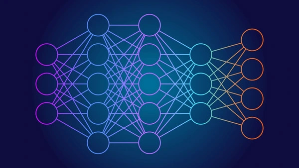
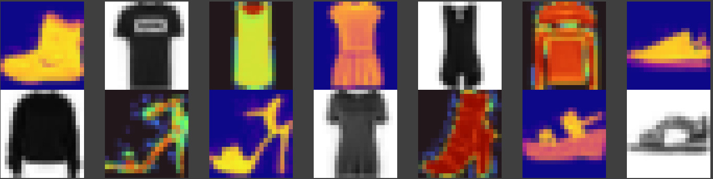
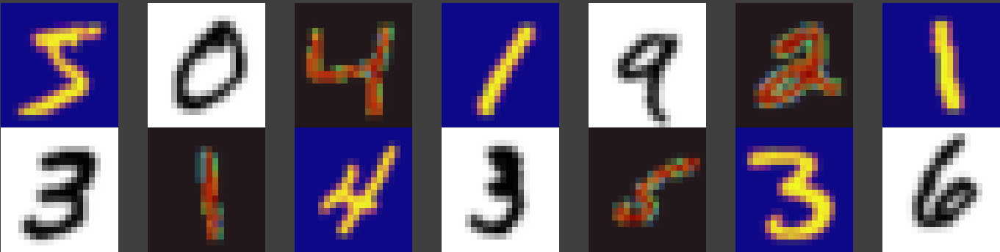

# neuron_dance

<p float="center">
  
</p>

<p float="center">
  
</p>


```rust
// fn main() {

let mut dataset: Box<dyn DataSet>: dataset = match ntype {
    NetworkType::CSV1 => Box::new(CSVData::new(CSVType::RGB)),
    NetworkType::CSV2 => Box::new(CSVData::new(CSVType::Custom("diabetes"))),
    NetworkType::Iris => Box::new(CSVData::new(CSVType::Custom("iris"))),
    NetworkType::Mnist => Box::new(MnistData::new(MnistType::Regular)),
};

let mut tts = dataset.train_test_split(train_percentage);
let mut subsets = tts.get_ref();
let mut model;

 match ntype {
        NetworkType::CSV1 => {
            model = Network::new();
            model.add(Input1(3));
            model.add(Dense(3, Act::Relu));
            model.add(Dense(1, Act::Sigmoid));
            model.compile(Loss::Quadratic, 0.2, 0.0, Metr(" accuracy , cost"));
            model.fit(&subsets, 10000, Batch::SGD, Eval::Train); // using SGD approach 
        },
        NetworkType::CSV2 => {
            tts = tts.min_max_scale(0.0, 1.0); // scale down the features to 0..1 
            subsets = tts.get_ref();

            model = Network::new();
            model.add(Input1(8));
            model.add(Dense(12, Act::Relu));
            model.add(Dense(8, Act::Relu));
            model.add(Dense(1, Act::SigmoidW(Weit::GlorotN)));
            model.compile(Loss::CrossEntropy, 0.5, 0.0, Metr("accuracy, cost"));
            model.fit(&subsets, 120, Batch::Mini(10), Eval::Train);
        },
        NetworkType::Iris => {
            model = Network::new();
            model.add(Input1(4));
            model.add(Dense(10, Act::Relu));
            model.add(Dense(10, Act::Relu));
            model.add(Dense(3, Act::Sigmoid));
            model.compile(Loss::CrossEntropy, 0.005, 0.3, Metr("accuracy, cost"));
            model.fit(&subsets, 100, Batch::Mini(5), Eval::Test);
        },
        NetworkType::Mnist => { // 784, 400, 400, 10
            model = Network::new();
            model.add(Input2(28, 28));
            model.add(Dense(100, Act::SigmoidW(Weit::GlorotN)));
            model.add(Dense(10, Act::SigmoidW(Weit::GlorotN)));
            model.compile(Loss::CrossEntropy, 0.1, 5.0, Metr("accuracy"));
            model.fit(&subsets, 10, Batch::Mini_(10, Optim::Adam), Eval::Test);
        }
    }
    model.eval(&subsets, Eval::Test);
```

> Example Usage

```rust

$ cargo run --release -- -t mnist
    Finished release [optimized] target(s) in 0.19s
     Running `/home/brpandey/Workspace/ml/rust/neuron_dance/target/release/neuron_dance -t mnist`
```

<p float="center">
  
</p>

```rust
Data subset shapes are x_train shape [60000, 784], y_train shape  [60000, 1],
x_test shape [10000, 784], y_test shape [10000, 1]

Epoch 0/5
	Accuracy 0.9571 9571/10000 (MiniBatch + Adam)

Epoch 1/5
	Accuracy 0.9659 9659/10000 (MiniBatch + Adam)

Epoch 2/5
	Accuracy 0.9689 9689/10000 (MiniBatch + Adam)

Epoch 3/5
	Accuracy 0.9700 9700/10000 (MiniBatch + Adam)

Epoch 4/5
	Accuracy 0.9720 9720/10000 (MiniBatch + Adam)

Successful y prediction, correct label is 9
-- See reduced, randomly chosen x input image below --
╭───┬───┬───┬───┬───┬───┬───┬───┬───┬───┬───┬───┬───┬───╮
│   ┆   ┆   ┆   ┆   ┆   ┆   ┆   ┆   ┆   ┆   ┆   ┆   ┆   │
├╌╌╌┼╌╌╌┼╌╌╌┼╌╌╌┼╌╌╌┼╌╌╌┼╌╌╌┼╌╌╌┼╌╌╌┼╌╌╌┼╌╌╌┼╌╌╌┼╌╌╌┼╌╌╌┤
│   ┆   ┆   ┆   ┆   ┆ @ ┆ X ┆ X ┆ # ┆ X ┆   ┆   ┆   ┆   │
├╌╌╌┼╌╌╌┼╌╌╌┼╌╌╌┼╌╌╌┼╌╌╌┼╌╌╌┼╌╌╌┼╌╌╌┼╌╌╌┼╌╌╌┼╌╌╌┼╌╌╌┼╌╌╌┤
│   ┆   ┆   ┆   ┆ % ┆ X ┆ X ┆ X ┆ X ┆ @ ┆   ┆   ┆   ┆   │
├╌╌╌┼╌╌╌┼╌╌╌┼╌╌╌┼╌╌╌┼╌╌╌┼╌╌╌┼╌╌╌┼╌╌╌┼╌╌╌┼╌╌╌┼╌╌╌┼╌╌╌┼╌╌╌┤
│   ┆   ┆   ┆   ┆ X ┆ X ┆ X ┆   ┆   ┆   ┆   ┆   ┆   ┆   │
├╌╌╌┼╌╌╌┼╌╌╌┼╌╌╌┼╌╌╌┼╌╌╌┼╌╌╌┼╌╌╌┼╌╌╌┼╌╌╌┼╌╌╌┼╌╌╌┼╌╌╌┼╌╌╌┤
│   ┆   ┆   ┆   ┆ % ┆ X ┆ X ┆ X ┆ X ┆ @ ┆   ┆   ┆   ┆   │
├╌╌╌┼╌╌╌┼╌╌╌┼╌╌╌┼╌╌╌┼╌╌╌┼╌╌╌┼╌╌╌┼╌╌╌┼╌╌╌┼╌╌╌┼╌╌╌┼╌╌╌┼╌╌╌┤
│   ┆   ┆   ┆   ┆ % ┆ X ┆ X ┆ X ┆ X ┆ X ┆   ┆   ┆   ┆   │
├╌╌╌┼╌╌╌┼╌╌╌┼╌╌╌┼╌╌╌┼╌╌╌┼╌╌╌┼╌╌╌┼╌╌╌┼╌╌╌┼╌╌╌┼╌╌╌┼╌╌╌┼╌╌╌┤
│   ┆   ┆   ┆   ┆   ┆   ┆   ┆ % ┆ X ┆ @ ┆   ┆   ┆   ┆   │
├╌╌╌┼╌╌╌┼╌╌╌┼╌╌╌┼╌╌╌┼╌╌╌┼╌╌╌┼╌╌╌┼╌╌╌┼╌╌╌┼╌╌╌┼╌╌╌┼╌╌╌┼╌╌╌┤
│   ┆   ┆   ┆   ┆   ┆   ┆   ┆ X ┆ X ┆ @ ┆   ┆   ┆   ┆   │
├╌╌╌┼╌╌╌┼╌╌╌┼╌╌╌┼╌╌╌┼╌╌╌┼╌╌╌┼╌╌╌┼╌╌╌┼╌╌╌┼╌╌╌┼╌╌╌┼╌╌╌┼╌╌╌┤
│   ┆   ┆   ┆   ┆   ┆   ┆   ┆ X ┆ X ┆ % ┆   ┆   ┆   ┆   │
├╌╌╌┼╌╌╌┼╌╌╌┼╌╌╌┼╌╌╌┼╌╌╌┼╌╌╌┼╌╌╌┼╌╌╌┼╌╌╌┼╌╌╌┼╌╌╌┼╌╌╌┼╌╌╌┤
│   ┆   ┆   ┆   ┆   ┆   ┆ % ┆ X ┆ X ┆   ┆   ┆   ┆   ┆   │
├╌╌╌┼╌╌╌┼╌╌╌┼╌╌╌┼╌╌╌┼╌╌╌┼╌╌╌┼╌╌╌┼╌╌╌┼╌╌╌┼╌╌╌┼╌╌╌┼╌╌╌┼╌╌╌┤
│   ┆   ┆   ┆   ┆   ┆   ┆ % ┆ X ┆ X ┆   ┆   ┆   ┆   ┆   │
├╌╌╌┼╌╌╌┼╌╌╌┼╌╌╌┼╌╌╌┼╌╌╌┼╌╌╌┼╌╌╌┼╌╌╌┼╌╌╌┼╌╌╌┼╌╌╌┼╌╌╌┼╌╌╌┤
│   ┆   ┆   ┆   ┆   ┆   ┆   ┆   ┆   ┆   ┆   ┆   ┆   ┆   │
╰───┴───┴───┴───┴───┴───┴───┴───┴───┴───┴───┴───┴───┴───╯
Successful y prediction, correct label is 3
-- See reduced, randomly chosen x input image below --
╭───┬───┬───┬───┬───┬───┬───┬───┬───┬───┬───┬───┬───┬───╮
│   ┆   ┆   ┆   ┆   ┆   ┆   ┆   ┆   ┆   ┆   ┆   ┆   ┆   │
├╌╌╌┼╌╌╌┼╌╌╌┼╌╌╌┼╌╌╌┼╌╌╌┼╌╌╌┼╌╌╌┼╌╌╌┼╌╌╌┼╌╌╌┼╌╌╌┼╌╌╌┼╌╌╌┤
│   ┆   ┆   ┆   ┆ @ ┆ # ┆ X ┆ @ ┆   ┆   ┆   ┆   ┆   ┆   │
├╌╌╌┼╌╌╌┼╌╌╌┼╌╌╌┼╌╌╌┼╌╌╌┼╌╌╌┼╌╌╌┼╌╌╌┼╌╌╌┼╌╌╌┼╌╌╌┼╌╌╌┼╌╌╌┤
│   ┆   ┆   ┆   ┆ X ┆ X ┆ X ┆ X ┆ X ┆ % ┆   ┆   ┆   ┆   │
├╌╌╌┼╌╌╌┼╌╌╌┼╌╌╌┼╌╌╌┼╌╌╌┼╌╌╌┼╌╌╌┼╌╌╌┼╌╌╌┼╌╌╌┼╌╌╌┼╌╌╌┼╌╌╌┤
│   ┆   ┆   ┆   ┆   ┆   ┆   ┆ % ┆ X ┆ X ┆   ┆   ┆   ┆   │
├╌╌╌┼╌╌╌┼╌╌╌┼╌╌╌┼╌╌╌┼╌╌╌┼╌╌╌┼╌╌╌┼╌╌╌┼╌╌╌┼╌╌╌┼╌╌╌┼╌╌╌┼╌╌╌┤
│   ┆   ┆   ┆   ┆   ┆   ┆   ┆   ┆ % ┆ X ┆ X ┆   ┆   ┆   │
├╌╌╌┼╌╌╌┼╌╌╌┼╌╌╌┼╌╌╌┼╌╌╌┼╌╌╌┼╌╌╌┼╌╌╌┼╌╌╌┼╌╌╌┼╌╌╌┼╌╌╌┼╌╌╌┤
│   ┆   ┆   ┆   ┆   ┆   ┆   ┆ @ ┆ @ ┆ X ┆ X ┆   ┆   ┆   │
├╌╌╌┼╌╌╌┼╌╌╌┼╌╌╌┼╌╌╌┼╌╌╌┼╌╌╌┼╌╌╌┼╌╌╌┼╌╌╌┼╌╌╌┼╌╌╌┼╌╌╌┼╌╌╌┤
│   ┆   ┆   ┆   ┆   ┆   ┆ @ ┆ X ┆ X ┆ X ┆ X ┆   ┆   ┆   │
├╌╌╌┼╌╌╌┼╌╌╌┼╌╌╌┼╌╌╌┼╌╌╌┼╌╌╌┼╌╌╌┼╌╌╌┼╌╌╌┼╌╌╌┼╌╌╌┼╌╌╌┼╌╌╌┤
│   ┆   ┆   ┆ X ┆   ┆   ┆   ┆ X ┆ X ┆ X ┆   ┆   ┆   ┆   │
├╌╌╌┼╌╌╌┼╌╌╌┼╌╌╌┼╌╌╌┼╌╌╌┼╌╌╌┼╌╌╌┼╌╌╌┼╌╌╌┼╌╌╌┼╌╌╌┼╌╌╌┼╌╌╌┤
│   ┆   ┆   ┆ X ┆ % ┆   ┆   ┆ % ┆ X ┆ X ┆   ┆   ┆   ┆   │
├╌╌╌┼╌╌╌┼╌╌╌┼╌╌╌┼╌╌╌┼╌╌╌┼╌╌╌┼╌╌╌┼╌╌╌┼╌╌╌┼╌╌╌┼╌╌╌┼╌╌╌┼╌╌╌┤
│   ┆   ┆   ┆ X ┆ X ┆ X ┆ X ┆ X ┆ X ┆ X ┆   ┆   ┆   ┆   │
├╌╌╌┼╌╌╌┼╌╌╌┼╌╌╌┼╌╌╌┼╌╌╌┼╌╌╌┼╌╌╌┼╌╌╌┼╌╌╌┼╌╌╌┼╌╌╌┼╌╌╌┼╌╌╌┤
│   ┆   ┆   ┆   ┆ @ ┆ X ┆ X ┆ X ┆ @ ┆   ┆   ┆   ┆   ┆   │
├╌╌╌┼╌╌╌┼╌╌╌┼╌╌╌┼╌╌╌┼╌╌╌┼╌╌╌┼╌╌╌┼╌╌╌┼╌╌╌┼╌╌╌┼╌╌╌┼╌╌╌┼╌╌╌┤
│   ┆   ┆   ┆   ┆   ┆   ┆   ┆   ┆   ┆   ┆   ┆   ┆   ┆   │
╰───┴───┴───┴───┴───┴───┴───┴───┴───┴───┴───┴───┴───┴───╯
Successful y prediction, correct label is 7
-- See reduced, randomly chosen x input image below --
╭───┬───┬───┬───┬───┬───┬───┬───┬───┬───┬───┬───┬───┬───╮
│   ┆   ┆   ┆   ┆   ┆   ┆   ┆   ┆   ┆   ┆   ┆   ┆   ┆   │
├╌╌╌┼╌╌╌┼╌╌╌┼╌╌╌┼╌╌╌┼╌╌╌┼╌╌╌┼╌╌╌┼╌╌╌┼╌╌╌┼╌╌╌┼╌╌╌┼╌╌╌┼╌╌╌┤
│   ┆   ┆   ┆   ┆   ┆   ┆ % ┆ # ┆ # ┆   ┆   ┆   ┆   ┆   │
├╌╌╌┼╌╌╌┼╌╌╌┼╌╌╌┼╌╌╌┼╌╌╌┼╌╌╌┼╌╌╌┼╌╌╌┼╌╌╌┼╌╌╌┼╌╌╌┼╌╌╌┼╌╌╌┤
│   ┆   ┆ X ┆ X ┆ X ┆ X ┆ X ┆ X ┆ X ┆ X ┆ % ┆   ┆   ┆   │
├╌╌╌┼╌╌╌┼╌╌╌┼╌╌╌┼╌╌╌┼╌╌╌┼╌╌╌┼╌╌╌┼╌╌╌┼╌╌╌┼╌╌╌┼╌╌╌┼╌╌╌┼╌╌╌┤
│   ┆   ┆ X ┆ X ┆ X ┆ X ┆ X ┆ @ ┆ X ┆ X ┆ @ ┆   ┆   ┆   │
├╌╌╌┼╌╌╌┼╌╌╌┼╌╌╌┼╌╌╌┼╌╌╌┼╌╌╌┼╌╌╌┼╌╌╌┼╌╌╌┼╌╌╌┼╌╌╌┼╌╌╌┼╌╌╌┤
│   ┆   ┆   ┆   ┆   ┆   ┆   ┆   ┆ X ┆ X ┆ X ┆   ┆   ┆   │
├╌╌╌┼╌╌╌┼╌╌╌┼╌╌╌┼╌╌╌┼╌╌╌┼╌╌╌┼╌╌╌┼╌╌╌┼╌╌╌┼╌╌╌┼╌╌╌┼╌╌╌┼╌╌╌┤
│   ┆   ┆   ┆   ┆   ┆   ┆   ┆   ┆ X ┆ X ┆ @ ┆   ┆   ┆   │
├╌╌╌┼╌╌╌┼╌╌╌┼╌╌╌┼╌╌╌┼╌╌╌┼╌╌╌┼╌╌╌┼╌╌╌┼╌╌╌┼╌╌╌┼╌╌╌┼╌╌╌┼╌╌╌┤
│   ┆   ┆   ┆   ┆   ┆   ┆   ┆ @ ┆ X ┆ X ┆ % ┆   ┆   ┆   │
├╌╌╌┼╌╌╌┼╌╌╌┼╌╌╌┼╌╌╌┼╌╌╌┼╌╌╌┼╌╌╌┼╌╌╌┼╌╌╌┼╌╌╌┼╌╌╌┼╌╌╌┼╌╌╌┤
│   ┆   ┆   ┆   ┆   ┆   ┆   ┆ X ┆ X ┆ X ┆   ┆   ┆   ┆   │
├╌╌╌┼╌╌╌┼╌╌╌┼╌╌╌┼╌╌╌┼╌╌╌┼╌╌╌┼╌╌╌┼╌╌╌┼╌╌╌┼╌╌╌┼╌╌╌┼╌╌╌┼╌╌╌┤
│   ┆   ┆   ┆   ┆   ┆   ┆ @ ┆ X ┆ X ┆ % ┆   ┆   ┆   ┆   │
├╌╌╌┼╌╌╌┼╌╌╌┼╌╌╌┼╌╌╌┼╌╌╌┼╌╌╌┼╌╌╌┼╌╌╌┼╌╌╌┼╌╌╌┼╌╌╌┼╌╌╌┼╌╌╌┤
│   ┆   ┆   ┆   ┆   ┆   ┆ X ┆ X ┆ X ┆   ┆   ┆   ┆   ┆   │
├╌╌╌┼╌╌╌┼╌╌╌┼╌╌╌┼╌╌╌┼╌╌╌┼╌╌╌┼╌╌╌┼╌╌╌┼╌╌╌┼╌╌╌┼╌╌╌┼╌╌╌┼╌╌╌┤
│   ┆   ┆   ┆   ┆   ┆   ┆ X ┆ X ┆ % ┆   ┆   ┆   ┆   ┆   │
├╌╌╌┼╌╌╌┼╌╌╌┼╌╌╌┼╌╌╌┼╌╌╌┼╌╌╌┼╌╌╌┼╌╌╌┼╌╌╌┼╌╌╌┼╌╌╌┼╌╌╌┼╌╌╌┤
│   ┆   ┆   ┆   ┆   ┆   ┆ X ┆ X ┆   ┆   ┆   ┆   ┆   ┆   │
╰───┴───┴───┴───┴───┴───┴───┴───┴───┴───┴───┴───┴───┴───╯
No match! y prediction 3 is different from correct y label 5
-- See reduced, randomly chosen x input image below --
╭───┬───┬───┬───┬───┬───┬───┬───┬───┬───┬───┬───┬───┬───╮
│   ┆   ┆   ┆   ┆   ┆   ┆   ┆   ┆   ┆   ┆   ┆   ┆   ┆   │
├╌╌╌┼╌╌╌┼╌╌╌┼╌╌╌┼╌╌╌┼╌╌╌┼╌╌╌┼╌╌╌┼╌╌╌┼╌╌╌┼╌╌╌┼╌╌╌┼╌╌╌┼╌╌╌┤
│   ┆   ┆   ┆   ┆   ┆   ┆   ┆ % ┆ X ┆ # ┆ X ┆   ┆   ┆   │
├╌╌╌┼╌╌╌┼╌╌╌┼╌╌╌┼╌╌╌┼╌╌╌┼╌╌╌┼╌╌╌┼╌╌╌┼╌╌╌┼╌╌╌┼╌╌╌┼╌╌╌┼╌╌╌┤
│   ┆   ┆   ┆   ┆   ┆   ┆ % ┆ X ┆ X ┆ X ┆ @ ┆   ┆   ┆   │
├╌╌╌┼╌╌╌┼╌╌╌┼╌╌╌┼╌╌╌┼╌╌╌┼╌╌╌┼╌╌╌┼╌╌╌┼╌╌╌┼╌╌╌┼╌╌╌┼╌╌╌┼╌╌╌┤
│   ┆   ┆   ┆   ┆   ┆ % ┆ # ┆ X ┆ X ┆ X ┆   ┆   ┆   ┆   │
├╌╌╌┼╌╌╌┼╌╌╌┼╌╌╌┼╌╌╌┼╌╌╌┼╌╌╌┼╌╌╌┼╌╌╌┼╌╌╌┼╌╌╌┼╌╌╌┼╌╌╌┼╌╌╌┤
│   ┆   ┆   ┆   ┆   ┆ X ┆ X ┆ X ┆ X ┆ X ┆   ┆   ┆   ┆   │
├╌╌╌┼╌╌╌┼╌╌╌┼╌╌╌┼╌╌╌┼╌╌╌┼╌╌╌┼╌╌╌┼╌╌╌┼╌╌╌┼╌╌╌┼╌╌╌┼╌╌╌┼╌╌╌┤
│   ┆   ┆   ┆   ┆   ┆ X ┆ X ┆ X ┆ X ┆ X ┆ % ┆   ┆   ┆   │
├╌╌╌┼╌╌╌┼╌╌╌┼╌╌╌┼╌╌╌┼╌╌╌┼╌╌╌┼╌╌╌┼╌╌╌┼╌╌╌┼╌╌╌┼╌╌╌┼╌╌╌┼╌╌╌┤
│   ┆   ┆ % ┆ @ ┆ % ┆   ┆ @ ┆ @ ┆ @ ┆ # ┆ % ┆   ┆   ┆   │
├╌╌╌┼╌╌╌┼╌╌╌┼╌╌╌┼╌╌╌┼╌╌╌┼╌╌╌┼╌╌╌┼╌╌╌┼╌╌╌┼╌╌╌┼╌╌╌┼╌╌╌┼╌╌╌┤
│   ┆ % ┆ X ┆ X ┆ X ┆   ┆   ┆   ┆ X ┆ X ┆ % ┆   ┆   ┆   │
├╌╌╌┼╌╌╌┼╌╌╌┼╌╌╌┼╌╌╌┼╌╌╌┼╌╌╌┼╌╌╌┼╌╌╌┼╌╌╌┼╌╌╌┼╌╌╌┼╌╌╌┼╌╌╌┤
│   ┆ % ┆ X ┆ X ┆ # ┆ % ┆ % ┆ X ┆ X ┆ X ┆   ┆   ┆   ┆   │
├╌╌╌┼╌╌╌┼╌╌╌┼╌╌╌┼╌╌╌┼╌╌╌┼╌╌╌┼╌╌╌┼╌╌╌┼╌╌╌┼╌╌╌┼╌╌╌┼╌╌╌┼╌╌╌┤
│   ┆   ┆ X ┆ X ┆ X ┆ X ┆ X ┆ X ┆ X ┆ @ ┆   ┆   ┆   ┆   │
├╌╌╌┼╌╌╌┼╌╌╌┼╌╌╌┼╌╌╌┼╌╌╌┼╌╌╌┼╌╌╌┼╌╌╌┼╌╌╌┼╌╌╌┼╌╌╌┼╌╌╌┼╌╌╌┤
│   ┆   ┆   ┆ @ ┆ X ┆ X ┆ X ┆ X ┆ % ┆   ┆   ┆   ┆   ┆   │
├╌╌╌┼╌╌╌┼╌╌╌┼╌╌╌┼╌╌╌┼╌╌╌┼╌╌╌┼╌╌╌┼╌╌╌┼╌╌╌┼╌╌╌┼╌╌╌┼╌╌╌┼╌╌╌┤
│   ┆   ┆   ┆   ┆   ┆   ┆   ┆   ┆   ┆   ┆   ┆   ┆   ┆   │
╰───┴───┴───┴───┴───┴───┴───┴───┴───┴───┴───┴───┴───┴───╯
Accuracy 0.9720 9720/10000

```
