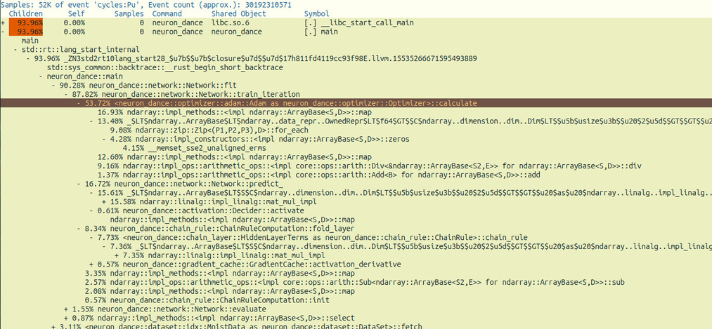

TODO

- [ ] add more tests
    - [X] visualize (partial)
    - [X] pool (partial)
    - [X] metrics (partial)
    - [X] network (partial)
    - [ ] algebra (e.g. smooth, maximum)
    - [ ] activation, cost functions
- [X] keep analyzing performance bottleneck in optimizer calcuate function 
    - [!] already tried map_inplace, zip's for_each and par_for_each for map
    - [!] map instances here refer to bias_correct, and momentum expression
    - [ ] write adam optimization in a different language?
    - [ ] [performance engineering](https://ocw.mit.edu/courses/6-172-performance-engineering-of-software-systems-fall-2018/resources/mit6_172f18_lec1/)

  

- [X] ~~protocol buffer~~ simple nanoserde binary serialization for network fields, activation and cost functions
      further: different files for different types of data, weight goes in weight file, hyper param into hyper file -> ~~same~~ saved_models directory
- [ ] cost functions, e.g. rms prop, sparse categorical entropy
- [ ] integrate [generics](https://github.com/brpandey/neuron_dance/tree/generics) branch?
- [ ] activation functions, e.g. [selu](https://www.tensorflow.org/api_docs/python/tf/keras/activations/selu) [swish](https://en.wikipedia.org/wiki/Swish_function)?
- [ ] add convolutional layer
- [ ] batch normalization layer
- [ ] custom layers e.g. residual blocks
- [ ] dropout, monte carlo dropout
- [ ] transfer learning, loading a pretrained model
- [ ] computation graph - processing subtrees of graph in parallel, separate syntax to describe gradient / node calculation
- [ ] leverage rust trait state machine?
    - [X] [Example gist](https://gist.github.com/brpandey/ec123fa12f79465b1cf51eff5654d9d1)
- [ ] add explicit Drop method functionality aside for generated implementation?
- [ ] edge cases - No input, matrices shapes don't match
- [ ] wrap redundant str/Act -> Box<dyn Activation> methods in a macro or smaller function
- [ ] delete unnecessary comments
- [ ] rewrite dataset implementations csv / idx as containers
- [~] replace uses of Array2 into more generic ArrayBase<S, Ix2> where S: Data<Elem=T>, to handle owned types and view types effortlessly
